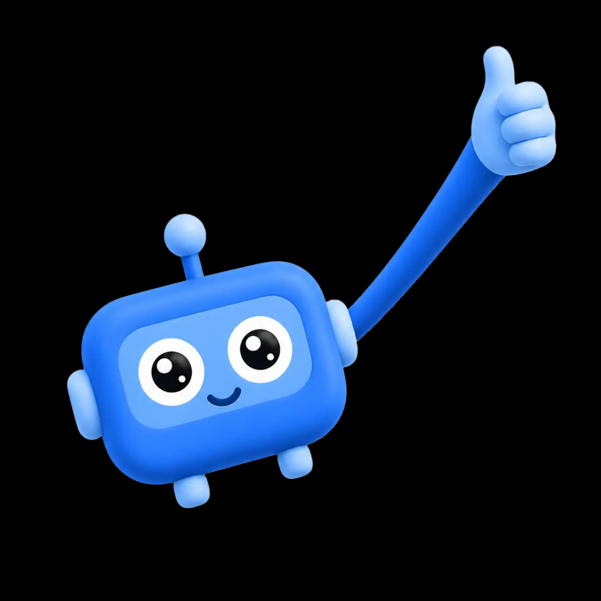

# ROBI

ROBI — настільний інтерактивний маскот школи ITRobotics: фізичний пристрій із сенсорним обличчям-екраном, камерою, датчиками, NFC, звуком і RGB-підсвіткою. Пристрій має працювати автономно на рецепції та отримувати сценарії від CRM через мережу.

> Статус: **концепт / pre-alpha**. Коду ще немає. Ця структура фіксує поточний напрям, але не є виробничою специфікацією.



> Референс показує руку в піднятому положенні. Це характер персонажа, а не механічна вимога: у v1 кінцівки статичні (`D-019`).

## Поточний baseline

Проєкт свідомо тримає залізо у відкритому стані. Ухвалено характер пристрою, межі поведінки й архітектуру. **Не** ухвалено платформу, дисплей і габарит — вони виводяться з вимірювань, а не задаються наперед.

### Ухвалено

**Поведінка**

- Режими: `mascot`, `qr`, `info`, `nfc`, `voice` (`D-032`).
- Мережеве керування та синхронізація з CRM через WebSocket/API з локальним offline fallback (`D-010`).
- Камера має єдину функцію: детекція обличчя, щоб ROBI дивився на людину (`D-033`).
- ROBI **не** сканує QR — вхідний сценарій покриває NFC-дотик; QR лише показується на екрані (`D-031`).
- Оплата курсів і товарів — посиланням на платіжного провайдера, а не NFC-транзакцією: ROBI віддає посилання, платіж відбувається в телефоні відвідувача (`D-035`).

**Межі**

- Без розпізнавання людей: ідентифікація, оцінка віку, статі та емоцій заборонені у v1 (`D-027`). Це біометричні дані неповнолітніх.
- Кадри й аудіо не зберігаються і не залишають пристрій.
- Платіжні реквізити не проходять через пристрій узагалі; платіжне посилання одноразове й перевіряється проти allowlist доменів локально (`D-038`).
- Апаратний індикатор активної камери, а не намальований у UI (`D-029`).

**Залізо**

- Без сервоприводів і рухомих кінцівок: руки й ноги статичні, «жест» реалізується анімацією обличчя, RGB і звуком (`D-019`).
- Одна 5 В шина живлення — без приводів зникає пікове навантаження й розділені гілки (`D-024`).
- Камера в кульці антени: верхній ракурс потрібен саме для детекції обличчя (`D-034`).
- NFC-зона в правому боковому модулі: лише динамічна мітка для телефона, без reader карток (`D-005`, `D-014`, `D-036`).
- ToF-датчик присутності, динамік з I²S-підсилювачем, керована RGB-підсвітка.

**Корпус**

- Дисплей — офіційний Raspberry Pi Touch Display 2, 7″, 1280×720, DSI (`D-021`).
- Габарит корпуса ~210 × 175 × 50 мм — **виведено** з панелі, а не обрано (`D-039`).
- 3D-друк із PLA, сервісна задня кришка на M2.5 і heat-set inserts (`D-007`, `D-008`).
- Електроніка на внутрішній рамі, не на кришці.
- Пасивна вентиляція знизу вгору та механічний резерв під вентилятор 30 мм (`D-009`).
- Окрема кнопка штатного ввімкнення/вимкнення і прихований master switch (`D-017`).

### Відкрито — змінюється вільно

| Питання | ID | Чим закривається |
|---|---|---|
| Обчислювальна платформа: Pi 4 vs Pi 5 | `D-022` | бенчмарк анімації з увімкненою камерою |
| Програмний стек і UI renderer | `D-015` | той самий бенчмарк |
| Хто володіє еквайрингом і фіскалізацією | `D-037` | рішення школи, не технічне |
| Ліцензії на код, CAD, docs і бренд | `D-011` | рішення власника |

Габарит корпуса свідомо відсутній у цьому списку: він не обирається, а **виводиться** з дисплея та внутрішньої компоновки (`D-020`). Перший розрахунок уже зроблено — `D-039`.

## Структура

```text
ROBI/
├── app/                         # застосунок пристрою (Python + pygame)
│   ├── config/                  # шаблони конфігурації без секретів
│   ├── src/robi/                # ядро, режими, UI, vision, CRM
│   └── tools/                   # fake CRM і бенчмарк
├── hardware/
│   ├── electronics/
│   │   ├── pcb/
│   │   ├── schematics/
│   │   └── wiring/
│   └── enclosure/
│       ├── cad/
│       ├── exports/
│       └── print-profiles/
├── assets/
│   ├── audio/
│   ├── branding/
│   ├── references/
│   └── ui/
├── docs/                        # архітектура, корпус, BOM, roadmap та рішення
├── scripts/                     # локальні утиліти складання/перевірки
└── tests/
    ├── hardware/
    ├── integration/
    └── unit/
```

Каталогу `firmware/` немає навмисно: без сервоприводів допоміжний мікроконтролер не потрібен (`D-016`, `D-019`). Якщо він колись знадобиться, це оформлюється новим рішенням.

## Документація

- [Журнал рішень](docs/decisions.md) — **починайте звідси.** 39 записів, з них 4 відкритих.
- [Device app](app/README.md) — запуск, fake CRM, бенчмарк і тести.
- [Архітектура](docs/architecture.md)
- [Апаратна частина](docs/hardware.md)
- [Корпус і 3D-друк](docs/enclosure.md)
- [Програмна частина](docs/software.md)
- [Інтеграція з CRM](docs/crm-integration.md)
- [Дорожня карта](docs/roadmap.md)
- [Попередній BOM](docs/bom.md)

## Принципи проєкту

1. Не фіксувати отвори, кронштейни або розводку до вимірювання реальних компонентів.
2. Габарит корпуса є похідною від компонентів, а не обмеженням для їх вибору.
3. Електроніка залишається на внутрішній рамі, а задня кришка знімається без дротів, що висять на ній.
4. Модулі камери, NFC та дисплея мають бути замінними без перероблення всього корпусу.
5. Приватність за замовчуванням: якщо дані можна не збирати — вони не збираються.
6. Секрети, CRM-токени, персональні дані та зібрані медіа не потрапляють у Git.
7. Кожне нове рішення фіксується в [docs/decisions.md](docs/decisions.md); зміна попереднього не переписує історію, а позначає його `superseded`.
8. Розширення скоупу оформлюється рішенням, а не мовчазним додаванням задач.

## Початок розробки

Поки стек і точні модулі не затверджені, команди встановлення навмисно відсутні.

Хвиля 0 виконана: state coordinator, режими `mascot` і `qr`, fake hardware, fake CRM і бенчмарк працюють на звичайному ПК без жодної закупівлі. Запуск і вимірювання описані в [app/README.md](app/README.md).

Наступний практичний крок — прогнати бенчмарк на кандидатах платформи.

Далі закупівля йде хвилями ([roadmap.md](docs/roadmap.md), M1):

| Хвиля | Що купується | Що закривається |
|---|---|---|
| 0 | нічого | стек, метрика анімації |
| 1 | платформа, microSD, БЖ | `D-022`, `D-015` |
| 2 | ToF, аудіо, RGB, NFC, камера, кнопки | power budget, `D-024` |
| 3 | дисплей (обрано, 3 909 грн) | габарит корпуса |
| 4 | PLA, inserts, кріплення | CAD freeze |

Дисплей купується не першим: це найдорожча позиція, а її вибір залежить від трьох ще відкритих рішень (`D-023`).

## Ліцензія

Ліцензію ще не обрано. До ухвалення рішення відкритої ліцензії немає; див. [LICENSE](LICENSE) і рішення `D-011` у [журналі рішень](docs/decisions.md). Брендовані зображення ROBI мають розглядатися окремо від майбутньої ліцензії на код.
