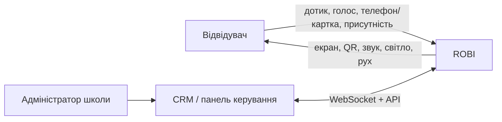

# Архітектура системи

## Статус документа

Чернетка системної архітектури для прототипу ROBI. Вона описує межі й відповідальності компонентів, але не фіксує мову програмування, конкретні бібліотеки, контакти GPIO чи остаточні протоколи.

Позначення:

- **Рішення** — погоджений напрям, який уже можна використовувати в проєктуванні.
- **Припущення** — робоча гіпотеза, яку треба перевірити прототипом.
- **TODO** — відкрите питання, що впливає на реалізацію.

## Контекст



**Рішення:** ROBI залишається працездатним без постійного з'єднання з CRM: показує mascot/info fallback і обробляє локальні сенсори.

**TODO:** визначити, які сценарії мають працювати повністю офлайн, а які потребують актуального CRM-стану.

## Логічні шари пристрою

```mermaid
flowchart TB
    CRM[CRM / backend] <-->|WebSocket / API| Link[CRM client]
    Link --> Coordinator[State & mode coordinator]
    Inputs[Touch · ToF · NFC · Mic] --> Events[Input/event layer]
    Camera[Camera] --> Vision[Vision: face detect]
    Vision --> Events
    Events --> Coordinator
    Coordinator --> UI[UI & animation]
    Coordinator --> Actions[Action scheduler]
    UI --> Display[Touch display]
    Actions --> HAL[Hardware abstraction]
    HAL --> Outputs[RGB · Audio]
    Config[Local config] --> Link
    Config --> Coordinator
    Health[Health, logs, metrics] <-- Inputs
    Health <-- Outputs
    Health --> Link
```

| Компонент | Відповідальність | Межі |
|---|---|---|
| CRM client | з'єднання, повторне підключення, команди, acknowledgements, телеметрія | не керує GPIO напряму |
| State & mode coordinator | єдине джерело поточного режиму, пріоритетів і переходів | не містить деталей драйверів |
| Input/event layer | нормалізація touch/ToF/NFC/voice/vision подій, debounce/rate limit | не вирішує бізнес-сценарій |
| Vision | детекція обличчя й положення людини в кадрі; віддає лише події, не кадри | не ідентифікує людину (`D-027`), не зберігає й не передає зображення |
| UI & animation | обличчя, QR, info-картки, стани помилки та offline | не залежить від конкретних GPIO |
| Action scheduler | синхронізація світла, звуку й UI; скасування дій | застосовує ліміти гучності/яскравості |
| Hardware abstraction | адаптери дисплея, NFC, ToF, audio, RGB, power | ізолює точні модулі від решти app |
| Health/logs | температура, доступність модулів, версія, помилки, watchdog | не зберігає секрети або сирі медіа за замовчуванням |

## Режими верхнього рівня

| Режим | Основна поведінка | Типовий тригер |
|---|---|---|
| `mascot` | анімоване обличчя, реакції на присутність, погляд у бік людини за детекцією обличчя | idle, локальна подія |
| `qr` | QR із чітким CTA та контрольованим часом показу; камера не бере участі | CRM або локальний сценарій |
| `info` | текст/графіка про заняття, події чи навігацію | CRM, розклад, touch |
| `nfc` | підказка про зону дотику, результат читання/передачі | CRM, наближення картки/телефона |
| `voice` | слухання, обробка та відповідь із видимим privacy-станом | touch/команда; wake word — TODO |

Режим не повинен напряму «володіти» обладнанням. Він формує намір, а action scheduler безпечно розподіляє дисплей, звук і RGB.

## Пріоритети та переходи

Попередній порядок пріоритетів:

1. перегрів або критична помилка живлення;
2. штатне вимкнення та сервісний режим;
3. активна взаємодія користувача;
4. команда CRM з обмеженим часом життя;
5. фоновий mascot/info сценарій.

**Припущення:** кожна зовнішня команда має `command_id`, строк актуальності та можливість скасування. Остаточний контракт ще не затверджено.

## Фізичне розгортання

- Обчислювальний модуль запускає device app, UI та мережевий клієнт. Конкретна платформа відкрита (`D-022`).
- Підключені модулі надаються app через апаратний abstraction layer.
- Допоміжний мікроконтролер не потрібен: без приводів RGB керується безпосередньо з обчислювального модуля (`D-019`, `D-016`).
- Конфігурація конкретного пристрою зберігається локально без секретів у Git.
- CRM endpoint, device credentials і токени інсталюються окремо під час provisioning.

## Нефункціональні вимоги

- **Безпечна деградація:** відмова CRM, камери чи NFC не повинна блокувати базове обличчя та інформаційний екран.
- **Обмежені виходи:** ліміти яскравості й гучності, таймаути сценаріїв, тиха безпечна поведінка після помилки. Рухомих виходів у v1 немає (`D-019`).
- **Відновлення:** автоматичний запуск після живлення, watchdog і контрольований rollback оновлення — механізм TODO.
- **Приватність:** камера й мікрофон мають **апаратний** видимий індикатор активності (`D-029`); кадри й аудіо не зберігаються і не залишають пристрій; ідентифікація людей заборонена (`D-027`).
- **Спостережуваність:** локальні структуровані журнали, температура, uptime, версії та стан периферії.
- **Сервісність:** заміна периферії не має вимагати переписування режимів.

## Відкриті питання

- TODO: вибрати обчислювальну платформу та програмний стек за вимірюваним бенчмарком (`D-022`, `D-015`).
- TODO: затвердити модель безпеки CRM, provisioning і ротацію ключів.
- TODO: формалізувати пріоритети одночасних touch/NFC/voice/CRM подій.
- TODO: визначити політику оновлень, rollback і відновлення SD-картки.
- TODO: погодити обробку персональних даних, карток, голосу та відео з урахуванням меж `D-027`.

