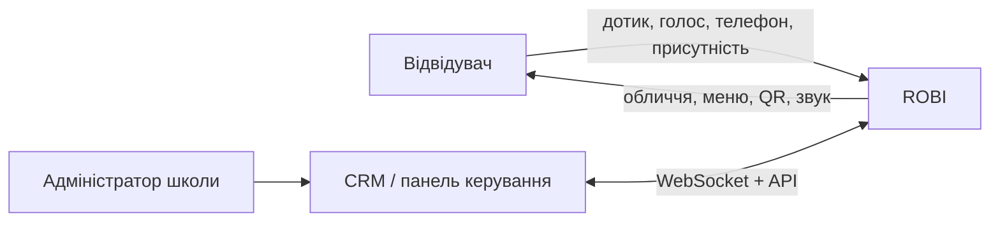

# Архітектура системи

## Статус документа

Чернетка системної архітектури для прототипу ROBI. Вона описує межі й відповідальності компонентів, але не фіксує конкретні бібліотеки, схему підключення периферії чи остаточні протоколи.

Посилання виду `D-0xx` вказують на записи в [decisions.md](decisions.md). Твердження без такого посилання є робочою гіпотезою, а не ухваленим рішенням.

## Контекст



**Рішення (`D-010`):** ROBI залишається працездатним без постійного з'єднання з CRM: показує mascot/info fallback і обробляє локальні сенсори.

**TODO:** визначити, які сценарії мають працювати повністю офлайн, а які потребують актуального CRM-стану.

## Логічні шари пристрою

```mermaid
flowchart TB
    CRM[CRM / backend] <-->|WebSocket / API| Link[CRM client]
    Link --> Coordinator[State & mode coordinator]
    Inputs[Touch · NFC · Mic] --> Events[Input/event layer]
    Camera[Camera] --> Vision[Vision: face detect]
    Vision -->|події, не кадри| Events
    Events --> Coordinator
    Coordinator --> UI[UI & animation]
    Coordinator --> Content[Контент-меню · кеш · анкета]
    Content --> UI
    Coordinator --> Actions[Action scheduler]
    UI --> Display[Екран планшета]
    Actions --> HAL[Hardware abstraction]
    HAL --> Outputs[Audio · NFC-мітка]
    Config[Local config] --> Link
    Config --> Coordinator
    Health[Health, logs, metrics] <-- Inputs
    Health <-- Vision
    Health <-- Outputs
    Health --> Link
```

| Компонент | Відповідальність | Межі |
|---|---|---|
| CRM client | з'єднання, повторне підключення, команди, acknowledgements, телеметрія | не керує периферією напряму |
| State & mode coordinator | єдине джерело поточного режиму, пріоритетів і переходів | не містить деталей драйверів |
| Input/event layer | нормалізація touch/NFC/voice/vision подій, debounce/rate limit | не вирішує бізнес-сценарій |
| Vision | детекція обличчя й положення людини в кадрі | не ідентифікує людину (`D-027`); не зберігає, не передає і не віддає кадри вгору |
| UI & animation | обличчя, QR, екрани меню, форма анкети, стани помилки та offline | не залежить від конкретних модулів |
| Контент-меню | дерево гілок, локальний кеш контенту й відео, анкета (`D-048`) | персональні дані не зберігає й не кешує (`D-049`) |
| Action scheduler | синхронізація звуку й UI; скасування дій | застосовує ліміти яскравості й гучності |
| Hardware abstraction | адаптер NFC через USB-I²C міст (`D-042`); дисплей, тач, звук і камера є засобами ОС | ізолює зовнішні модулі від решти app |
| Health/logs | температура, доступність модулів, версія, помилки, watchdog | не зберігає секрети або сирі медіа за замовчуванням |

**Ключова межа:** `Vision` — єдиний компонент, що бачить кадр. Вище за нього піднімаються лише події виду «є обличчя / скільки / де». Це робить заборону `D-027` архітектурною, а не дисциплінарною: решта системи просто не має доступу до зображення.

## Режими верхнього рівня

Набір режимів зафіксовано в `D-032`.

| Режим | Основна поведінка | Типовий тригер | Камера |
|---|---|---|---|
| `mascot` | анімоване обличчя, реакція на присутність, погляд у бік людини | idle, локальна подія | активна |
| `qr` | показ QR із чітким CTA та контрольованим часом | CRM або локальний сценарій | не бере участі |
| `info` | контент-меню: курси, ціни, відео, товари й моделі, анкета (`D-048`) | touch, CRM | не бере участі |
| `nfc` | підказка про зону дотику, результат передачі посилання | наближення телефона | не бере участі |
| `voice` | слухання, обробка та відповідь із видимим privacy-станом; доля режиму відкрита (`D-050`) | touch/команда; wake word — TODO | не бере участі |

Режим не повинен напряму «володіти» обладнанням. Він формує намір, а action scheduler безпечно розподіляє дисплей і звук. Фізичної підсвітки більше немає (`D-043`).

**Наслідок постійно активної камери.** `mascot` є фоновим режимом за замовчуванням, тому камера працює майже весь час роботи пристрою. Видимої події «сканування» не існує — користувач не має способу здогадатися про активність камери самостійно. Саме тому апаратний індикатор (`D-029`) є вимогою, а не покращенням. На платформі `D-040` цю роль виконує штатний індикатор камери планшета (`D-045`).

## Пріоритети та переходи

Попередній порядок пріоритетів:

1. перегрів або критична помилка живлення;
2. штатне вимкнення та сервісний режим;
3. активна взаємодія користувача;
4. команда CRM з обмеженим часом життя;
5. фоновий mascot/info сценарій.

**Припущення:** кожна зовнішня команда має `command_id`, строк актуальності та можливість скасування. Остаточний контракт ще не затверджено.

## Фізичне розгортання

- Планшет Surface Go 2 запускає device app, UI, vision і мережевий клієнт (`D-040`). Дисплей, тач, звук, мікрофони, камера й Wi-Fi є його вбудованими засобами, а не підключеними модулями.
- Єдиний зовнішній модуль — динамічна NFC-мітка через USB-I²C міст у єдиний USB-C (`D-042`, `D-036`).
- Допоміжний мікроконтролер не потрібен: міст не має власної прошивки, тому `D-016` лишається знятим і каталог `firmware/` не з'являється.
- Живлення йде окремим роз'ємом Surface Connect і не конкурує з USB (`D-044`).
- Windows налаштований на автологін, автозапуск app і оновлення в неробочі години; обліковий запис локальний, без синхронізації (`D-049`).
- Конфігурація конкретного пристрою зберігається локально без секретів у Git.
- CRM endpoint, device credentials і токени інсталюються окремо під час provisioning.

## Нефункціональні вимоги

- **Безпечна деградація:** відмова CRM, камери чи моста NFC не повинна блокувати базове обличчя та меню. Без камери `mascot` працює, просто без погляду; без моста недоступний лише режим `nfc`.
- **Обмежені виходи:** ліміти яскравості й гучності, таймаути сценаріїв, тиха безпечна поведінка після помилки. Рухомих виходів у v1 немає (`D-019`).
- **Відновлення:** автологін, автозапуск app і watchdog. Планшет не вмикається сам від появи 220 В так, як це робить одноплатник, тому фактична поведінка після зникнення живлення перевіряється й документується (`D-044`).
- **Приватність:** камера й мікрофон мають апаратний видимий індикатор активності (`D-029`, `D-045`); кадри й аудіо не зберігаються і не залишають пристрій; ідентифікація людей заборонена (`D-027`); дані анкети не осідають на пристрої (`D-049`).
- **Спостережуваність:** локальні структуровані журнали, температура, uptime, версії та стан периферії.
- **Сервісність:** заміна периферії не має вимагати переписування режимів.

## Відкриті питання

- TODO: затвердити модель безпеки CRM, provisioning і ротацію ключів.
- TODO: формалізувати пріоритети одночасних touch/NFC/CRM подій і пріоритет анкети над командами CRM.
- TODO: визначити схему контенту меню й формат локального кешу (`D-048`).
- TODO: визначити політику оновлень app і відкату на Windows.
- TODO: погодити письмову політику обробки персональних даних, включно з текстом згоди в анкеті (`D-027`, `D-049`).
- TODO: закрити долю режиму `voice` (`D-050`).
